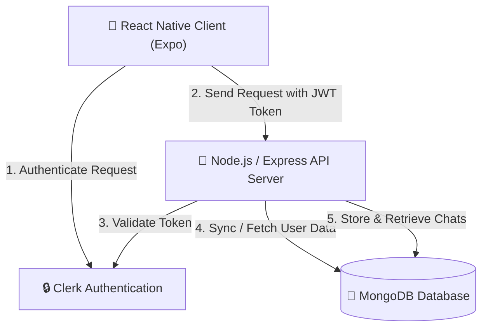
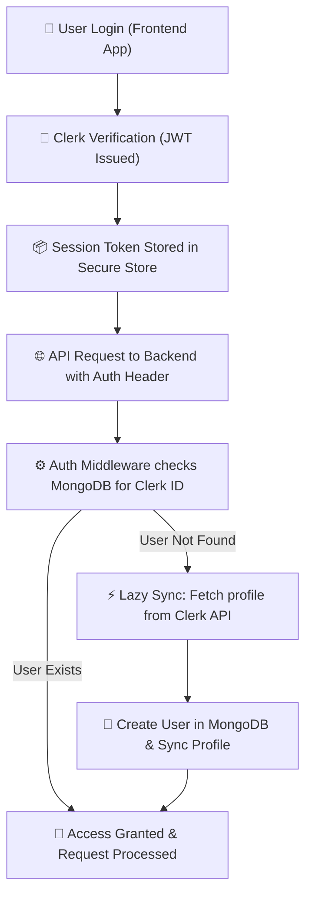
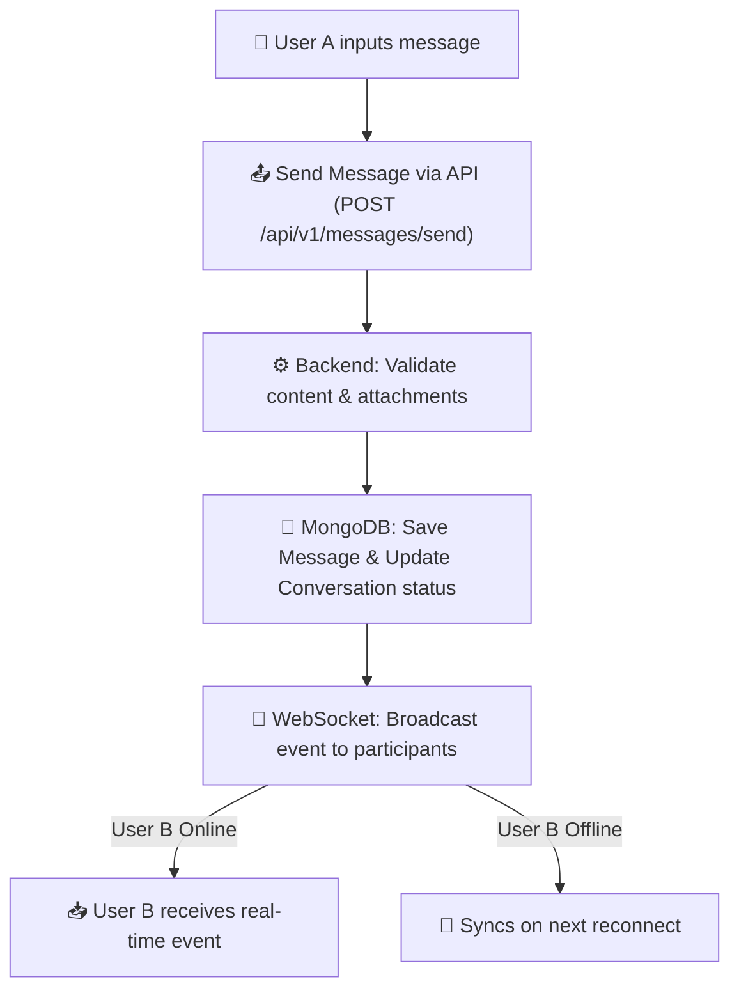
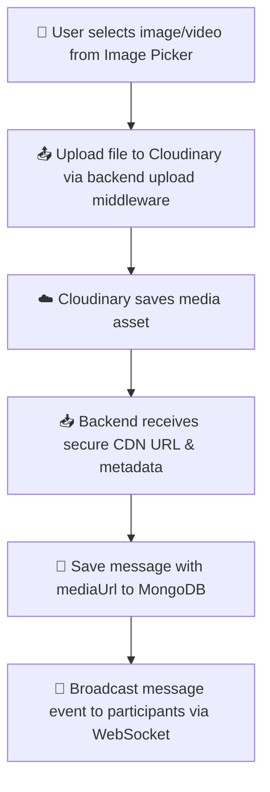
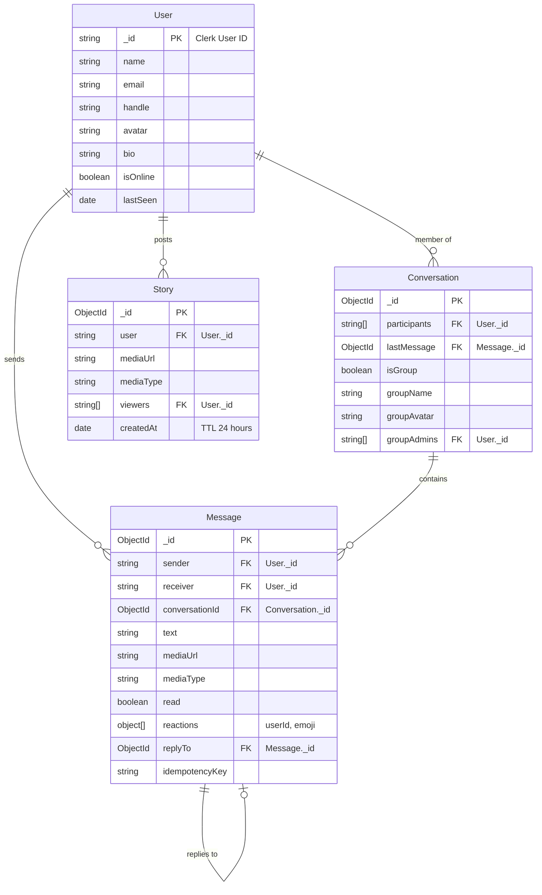

# 📱 InstaChat - Real-Time Chat & Sharing Platform

Welcome to **InstaChat**, a professional-grade, real-time messaging and story-sharing application. Built using a modern **React Native (Expo)** frontend and a secure **Node.js (Express) TypeScript** backend, InstaChat provides users with an instant, engaging, and premium communication experience modeled after leading social platforms.

InstaChat addresses the challenge of building responsive, cross-platform messaging clients by integrating high-performance native WebSockets, robust state management (Zustand), and a secure authentication workflow (Clerk).

---

## 📖 Table of Contents

- [1. Project Overview](#1-project-overview)
- [2. Features](#2-features)
- [3. Tech Stack](#3-tech-stack)
- [4. System Architecture](#4-system-architecture)
- [5. Project Flow](#5-project-flow)
- [6. Frontend Structure](#6-frontend-structure)
- [7. Backend Structure](#7-backend-structure)
- [8. Database Design](#8-database-design)
- [9. API Overview](#9-api-overview)
- [10. WebSocket Events](#10-websocket-events)
- [11. Environment Variables](#11-environment-variables)
- [12. Installation & Setup](#12-installation--setup)
- [13. Security Considerations](#13-security-considerations)
- [14. Performance Optimizations](#14-performance-optimizations)
- [15. Future Roadmap](#15-future-roadmap)
- [16. Contributing](#16-contributing)
- [17. Author](#17-author)

---

## 1. Project Overview

InstaChat is a features-rich chat application developed to facilitate instant messaging, story posting, and media sharing. It is built as a portfolio-grade showcase of modern full-stack development patterns, highlighting real-time state synchronization, secure cloud media storage, and hybrid user accounts management.

### Why it was built
Instant messaging is a staple of modern web applications. However, handling real-time states across native mobile environments, syncing user status under network fluctuations, and maintaining low-latency database queries present complex architectural challenges. InstaChat serves as an implementation template for these exact engineering hurdles.

### Key Value Propositions
* **Zero-Lag Messaging:** Leverages lightweight, native WebSocket channels.
* **Seamless Media Pipelines:** Integrates direct buffer stream uploads to Cloudinary with automatic CDN resolution.
* **Lazy Synchronization:** Syncs Clerk user authentication details on-demand to MongoDB, avoiding redundant network roundtrips.
* **Premium UX/UI:** Adheres to sleek dark/light system modes, rich feedback patterns, and modular component design.

---

## 2. Features

### 🔐 Authentication
* **Clerk Auth Integration:** Enterprise-grade authentication with social logins and device-based session validation.
* **Protected Routes:** Auto-redirection via Expo Router layouts based on session presence.
* **Session Management:** Secure token caching and persistent storage using `expo-secure-store`.

### 💬 Messaging
* **Real-Time Delivery:** Instant message delivery with minimal communication overhead.
* **Read Status Tracking:** Unread message counts and real-time read receipts (`read: true`).
* **Typing Indicators:** Real-time visibility into who is currently drafting a reply.
* **Online Presence:** Dynamic indicators demonstrating active users and "Last Seen" timestamps.
* **Advanced Controls:** Support for message edits, deletions, reactions, and replies/threading.

### 🖼️ Media
* **Image & Video Sharing:** Send full-resolution images or videos directly within chat screens.
* **Cloudinary CDN Storage:** Assets are stored in the cloud and loaded via optimized CDN urls.
* **Stories Mode:** Post image/video stories that auto-expire after 24 hours (implemented via MongoDB TTL indexes).

### ✨ User Experience (UX)
* **Glassmorphic UI:** Sleek visual design leveraging gradient maps and overlay styles.
* **Theme Switching:** Context-based Light and Dark modes.
* **Smooth Animations:** Integrated with `react-native-reanimated` and native gesture handling.
* **Graceful Degradation:** Custom skeletons, loading bars, and interactive error banners.

---

## 3. Tech Stack

| Layer | Technology | Purpose |
| :--- | :--- | :--- |
| **Frontend** | React Native (Expo SDK 56) | Cross-platform native application framework |
| | TypeScript | Compile-time type safety and strict schema alignment |
| | Expo Router | File-based, nested route configuration |
| | Clerk SDK | Identity verification and session state |
| | Zustand | Ultra-fast client-side global store management |
| | WebSocket Client | Native browser/device socket connection |
| **Backend** | Node.js / Express.js (v5) | REST API framework and execution engine |
| | TypeScript | Strict types for server logic and schemas |
| | WebSockets (`ws` library) | High-performance raw socket protocol |
| **Database** | MongoDB | Primary document store for application state |
| | Mongoose ODM | Object Data Modeling and schema constraint validation |
| **Storage** | Cloudinary | Asset storage, image transformations, and CDN distribution |
| **Auth Provider** | Clerk | Authentication provider |

---

## 4. System Architecture

InstaChat utilizes a decoupled, event-driven architecture designed to minimize latency. 

### High-Level API Request Flow
Users authenticate via the Clerk SDK on the client. The resulting JSON Web Token (JWT) is included as a `Bearer` token in the `Authorization` header of all subsequent API requests. The backend validates this token against Clerk's authorization servers, matches it with database entities, and completes the action.



### Real-Time WebSocket Architecture
For messaging and real-time statuses, a direct bidirectional WebSocket connection is established. Tokens are passed in the connection parameters (`ws://host/ws?token=...`) to authenticate connection requests before registration.

```mermaid
sequenceDiagram
    autonumber
    actor UserA as User A (Sender)
    participant WS as WebSocket Server
    participant DB as MongoDB
    actor UserB as User B (Receiver)

    Note over UserA, WS: Active WebSocket Connection with Clerk JWT
    UserA->>WS: Send message (Payload)
    activate WS
    WS->>DB: Save Message & Update Conversation Last Message
    WS->>WS: Locate User B WS Session
    alt User B is online
        WS->>UserB: Send real-time event (Payload)
    else User B is offline
        Note over WS: Message stored in DB;<br/>delivers when User B reconnects
    end
    deactivate WS
```

---

## 5. Project Flow

### Authentication Flow
InstaChat uses a "lazy database synchronization" model. The user profile is created inside Clerk first; the MongoDB record is synchronized automatically during their first API interaction if it does not already exist.



### Messaging Flow


### Media Upload Flow


---

## 6. Frontend Structure

The frontend is built inside a React Native Expo project structure. Below is a detailed view of the application layout:

```directory
frontend/
├── assets/             # Static visual assets (icons, splash screens, fonts)
├── components/         # Reusable UI elements (Avatars, Message Bubbles, Stories)
├── constants/          # App constants (System Colors, Config host endpoints)
├── context/            # Global context providers (ThemeContext, Socket/AppContext)
├── store/              # Zustand state slices (authStore, chatStore, uiStore)
├── types/              # TypeScript interface files
├── utils/              # Helper utilities (date and time formatters)
└── src/
    └── app/            # Expo Router File-Based Routing Root
        ├── (auth)/     # Auth-protected routes (Login and Landing Screens)
        ├── (tabs)/     # Primary App tabs (Home, Chats, Search, Profile)
        ├── chat/       # Chat flow screens (create-group, [id] message list)
        └── _layout.tsx # Root stack layout & provider tree assembly
```

### Key Folder Descriptions
* **`app/` / `src/app/`**: Implements folder-based routing. Routes inside `(auth)` manage user registration, while folders inside `(tabs)` present the post-login layouts.
* **`components/`**: House modular view elements. Includes `Bubble.tsx` (message render), `StoryBar.tsx` (horizontal stories carousel), and `StoryViewer.tsx` (full-screen expiring stories).
* **`context/`**: Contains providers like `AppContext.tsx` which manages the WebSocket connections lifecycle, state sync, and HTTP interceptor attachments.
* **`store/`**: Contains reactive store definitions using Zustand. Used to cache user attributes, conversations, and current active messages, reducing context rendering loops.

---

## 7. Backend Structure

The backend is built as a modular TypeScript Node.js server. Below is a breakdown of the repository:

```directory
backend/
├── src/
│   ├── config/         # Server startups (Cloudinary configs, MongoDB, Env schema)
│   ├── controllers/    # Route controllers (Users, messages, story handlers)
│   ├── middlewares/    # Custom Express filters (Auth filters, limiters, validator)
│   ├── models/         # Mongoose schema definitions (User, Message, Conv, Story)
│   ├── routes/         # Express endpoint definitions (Routing entry points)
│   ├── socket/         # WebSocket managers (WS connection loops and event routing)
│   ├── validations/    # Zod payload structures for payload compliance
│   └── server.ts       # Application entry point & shutdown handles
└── utils/              # Backend utilities (database queries helpers)
```

### Key Folder Descriptions
* **`config/`**: Sets up base utilities. Evaluates environment variables via Zod schemas to stop servers immediately if configuration variables are misconfigured.
* **`controllers/`**: Coordinates database state changes. Validates inputs, saves entities, and dispatches updates via WebSockets.
* **`middlewares/`**: Intercepts requests. Includes Clerk API authentication verification, Multer file parses, rate-limiting handlers, and unified error handling layers.
* **`socket/`**: Maintains server connections. Maps authenticated user IDs to active WebSockets to enable direct routing.

---

## 8. Database Design

InstaChat uses MongoDB via Mongoose. Schema connections are built using Clerk-provided user IDs rather than MongoDB ObjectIds for user mappings, streamlining external profile syncs.

### Collection Relationships



### Schema Optimization Notes
* **Compound Indexing:** Messages collections use compound indexes such as `{ conversationId: 1, createdAt: -1 }` to guarantee fast pagination.
* **TTL Expiration:** Story documents use a TTL index on `createdAt` with an expiry of 86,400 seconds (24 hours), automating cleanup of stories.
* **Idempotency Keys:** Messages use a unique index on `idempotencyKey` to prevent double-posting due to poor mobile connectivity retries.

---

## 9. API Overview

All endpoint routes are versioned and prefixes are mapped to `/api/v1`.

### User APIs (`/api/v1/users`)
| Method | Endpoint | Auth | Description |
| :--- | :--- | :--- | :--- |
| **GET** | `/` | Yes | Retrieves list of all active database users. |
| **GET** | `/search` | Yes | Searches users using a partial name/handle query filter. |
| **GET** | `/profile` | Yes | Retrieves current user's database profile. |
| **PUT** | `/profile` | Yes | Updates profile fields (supports single multipart file uploads for avatar images). |

### Conversation APIs (`/api/v1/messages/conversations`)
| Method | Endpoint | Auth | Description |
| :--- | :--- | :--- | :--- |
| **GET** | `/` | Yes | Retrieves a chronological list of active conversations. |
| **POST** | `/group` | Yes | Creates a group conversation with participant lists. |
| **PUT** | `/:conversationId/members` | Yes | Adds or removes member lists from active groups (admin auth). |
| **GET** | `/:conversationId/messages` | Yes | Fetches paginated messages inside a conversation. |
| **GET** | `/with/:targetUserId` | Yes | Finds or instantiates a direct 1-to-1 conversation item. |
| **PUT** | `/:conversationId/read` | Yes | Marks all incoming messages in a conversation as read. |
| **DELETE**| `/:conversationId` | Yes | Wipes conversation and messages documents (participants only). |

### Message APIs (`/api/v1/messages`)
| Method | Endpoint | Auth | Description |
| :--- | :--- | :--- | :--- |
| **POST** | `/send` | Yes | Appends messages. Supports attachments, text bodies, and replies. |
| **POST** | `/:messageId/react` | Yes | Toggles or edits emoji reactions. |
| **DELETE**| `/:messageId` | Yes | Removes a specific message (sender only). |
| **PUT** | `/:messageId` | Yes | Modifies text content of a message (sender only). |

### Story APIs (`/api/v1/stories`)
| Method | Endpoint | Auth | Description |
| :--- | :--- | :--- | :--- |
| **POST** | `/` | Yes | Uploads media content and stores it as an expiring Story. |
| **GET** | `/` | Yes | Retrieves stories matching the current user's profile network. |
| **POST** | `/:storyId/view` | Yes | Tracks user IDs viewing stories. |

---

## 10. WebSocket Events

InstaChat utilizes raw WebSocket server routes (`ws://host/ws`) to minimize framing footprints. All messages are serialized as JSON objects.

### Client-to-Server Payloads

#### `message`
Dispatched when a user publishes a text block or file.
```json
{
  "type": "message",
  "conversationId": "65893a46e10f135b912239ad",
  "receiverId": "user_2TxlfKzPqfR8...",
  "payload": {
    "text": "Hello, this is a real-time message!"
  }
}
```

#### `typing`
Alerts other users that a specific contact is currently typing.
```json
{
  "type": "typing",
  "conversationId": "65893a46e10f135b912239ad",
  "isTyping": true
}
```

---

### Server-to-Client Payloads

#### `online_status`
Fired when a user connects or disconnects from the application.
```json
{
  "type": "online_status",
  "userId": "user_2TxlfKzPqfR8...",
  "isOnline": true
}
```

#### `messages_read`
Indicates that a participant has read messages inside a conversation.
```json
{
  "type": "messages_read",
  "conversationId": "65893a46e10f135b912239ad",
  "readerId": "user_2TxlfKzPqfR8..."
}
```

#### `message_reaction`
Dispatched when a participant adds or updates a reaction.
```json
{
  "type": "message_reaction",
  "messageId": "65893ad7e10f135b912239b5",
  "reactions": [
    { "userId": "user_2TxlfKzPqfR8...", "emoji": "❤️" }
  ]
}
```

---

## 11. Environment Variables

To execute the project, define the following keys.

### 📱 Frontend Variables (`frontend/.env`)
* `EXPO_PUBLIC_CLERK_PUBLISHABLE_KEY`: The public API credential used by the Clerk Expo package to initialize auth gates.

### 🚀 Backend Variables (`backend/.env`)
* `PORT`: Server port (e.g., `8000`).
* `MONGODB_URI`: Complete MongoDB Connection URL (e.g., Local URI or MongoDB Atlas Cluster).
* `CLERK_PUBLISHABLE_KEY`: The public key from the Clerk Dashboard.
* `CLERK_SECRET_KEY`: Used to verify JWT headers in API requests.
* `CLOUDINARY_CLOUD_NAME`: Cloudinary account designation.
* `CLOUDINARY_API_KEY`: API credential key.
* `CLOUDINARY_API_KEY_SECRET`: Secret key for secure buffer streaming.

---

## 12. Installation & Setup

InstaChat uses Bun for fast dependency installs, but standard package managers like npm can be used.

### Step 1: Clone the Repository
```bash
git clone https://github.com/Surajgupta001/InstaChat.git
cd InstaChat
```

### Step 2: Backend Configuration
1. Navigate to the backend directory:
   ```bash
   cd backend
   ```
2. Install dependencies:
   ```bash
   bun install # or npm install
   ```
3. Set up environment variables:
   Create a `.env` file inside the `backend/` folder and populate it:
   ```env
   PORT=8000
   MONGODB_URI=your_mongodb_connection_string
   CLERK_PUBLISHABLE_KEY=your_clerk_publishable_key
   CLERK_SECRET_KEY=your_clerk_secret_key
   CLOUDINARY_CLOUD_NAME=your_cloudinary_cloud_name
   CLOUDINARY_API_KEY=your_cloudinary_api_key
   CLOUDINARY_API_KEY_SECRET=your_cloudinary_api_secret
   ```

### Step 3: Frontend Configuration
1. Navigate to the frontend directory:
   ```bash
   cd ../frontend
   ```
2. Install dependencies:
   ```bash
   bun install # or npm install
   ```
3. Set up environment variables:
   Create a `.env` file inside the `frontend/` folder:
   ```env
   EXPO_PUBLIC_CLERK_PUBLISHABLE_KEY=your_clerk_publishable_key
   ```
4. Verify your local connection settings inside [Config.ts](file:///c:/Programming/InstaChat/frontend/constants/Config.ts) to match your machine's local IP address when testing on physical mobile devices.

### Step 4: Run the Application

#### Start the Backend Server:
```bash
cd backend
bun run server # Or npm run server (Runs nodemon hot-reload with tsx compilation)
```

#### Start the Frontend Expo Server:
```bash
cd frontend
bun run start # Or npm run start
```
Use the Expo Go app on iOS or Android, or press `a` (Android), `i` (iOS), or `w` (Web) in the Expo CLI prompt to run.

### Step 5: Build the Application
* **Backend compilation:**
  ```bash
  cd backend
  bun run build # Or npm run build (Compiles TypeScript files to JS in /dist)
  ```
* **Frontend local binary build:**
  Ensure you have EAS CLI installed globally:
  ```bash
  npm install -g eas-cli
  eas build --platform android # For Android build configuration
  eas build --platform ios     # For iOS build configuration
  ```

---

## 13. Security Considerations

* **Secure Authentication Gates:** API requests are guarded via Clerk token checks. Sockets disconnect instantly if a token is absent or invalid.
* **Input Validation:** Backend endpoints enforce validations on body parameters and queries via custom schema middleware (using Zod), rejecting malformed inputs.
* **Secure Media Pipelines:** Multer parses uploads into RAM buffers. Upload limits are enforced (`express.json({ limit: '1mb' })`) to prevent Denial of Service (DoS) attacks.
* **HTTP Parameter Pollution (HPP):** Protected using Express `hpp` middle layer to discard array pollution parameters.
* **Strict CORS:** Allowed origins are locked using `.env` configurations to block unauthorized domain access.

---

## 14. Performance Optimizations

* **WebSocket Heartbeats:** Server-side scheduler validates socket health every 30 seconds using raw `.ping()` and `.pong()` flags to clean up inactive connections.
* **Index Alignments:** Crucial indexes exist on Mongoose schemas (e.g., index on participants, compound sorting keys on messages, and unique message identifiers) to prevent full database collection scans.
* **Lean Queries:** Database reads use `.lean()` whenever write methods are not needed, bypassing heavy Mongoose object instantiation.
* **Lazy User Synchronization:** Users are only created in MongoDB upon their first database request rather than syncing at registration, lowering Clerk webhooks workload.
* **TTL Collection Indexes:** Expired stories are automatically cleaned up in the background by MongoDB, keeping storage requirements minimal.

---

## 15. Future Roadmap

- [ ] **Push Notifications:** Add Google FCM / APNs integration using Expo Notifications.
- [ ] **Group Calling:** Integrate WebRTC or Zoom Video SDK for voice and video group rooms.
- [ ] **End-to-End Encryption:** Set up Signal Protocol keys for peer-to-peer chat cryptography.
- [ ] **Message Search:** Implement full-text indexing in MongoDB to quickly search messages.
- [ ] **Offline Cache & Sync:** Use WatermelonDB or SQLite on the client to store chats offline and sync when reconnected.

---

## 16. Contributing

We welcome contributions to InstaChat! To contribute:

1. **Fork the Repository** to your GitHub account.
2. **Create a Feature Branch** (`git checkout -b feature/AmazingFeature`).
3. **Commit Your Changes** (`git commit -m 'Add some AmazingFeature'`).
4. **Push to the Branch** (`git push origin feature/AmazingFeature`).
5. **Open a Pull Request** for review.

Please ensure your code conforms to the project's TypeScript rules and includes unit tests for any new API routes.

---

## 17. Author

* **Name:** Suraj Gupta
* **GitHub:** [@Surajgupta001](https://github.com/Surajgupta001)
* **LinkedIn:** [Suraj Gupta](https://www.linkedin.com/in/surajgupta001)
* **Portfolio:** [surajgupta.dev](https://surajgupta.dev)

---

*InstaChat © 2026. Made with ❤️ by Suraj Gupta.*
